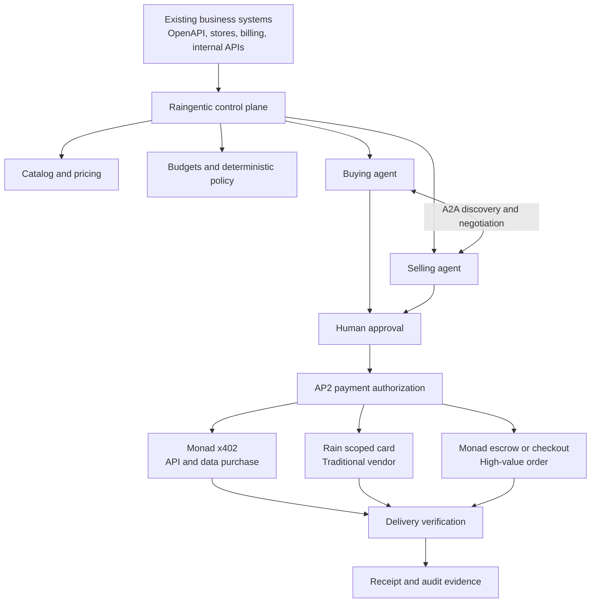

# Raingentic

Raingentic is a business control plane for agent commerce. It lets companies connect what they already buy and sell, define the authority their agents receive, negotiate through A2A, authorize payment through AP2, and route each transaction through Monad x402, Rain, or a high-value escrow flow.

It does not replace a company’s API backend, Shopify store, billing system, inventory, or fulfillment. It makes those systems discoverable and safely usable by autonomous agents.

[Live application](https://raingentic.saibolla.com) · [Dashboard](https://raingentic.saibolla.com/dashboard) · [A2A Agent Card](https://raingentic.saibolla.com/.well-known/agent-card.json) · [PreFlight OpenAPI](https://preflight.saibolla.com/openapi.json) · [Monad contract](https://monadvision.com/address/0x2403498812e217ab86dd0e937e60fe09bfe73fb1)

Built for the Raingentic Commerce Hackathon NYC, co-hosted by Rain and the Monad Foundation.

## The problem

Agents can find information and call tools, but businesses still need answers to harder questions:

- What is the agent allowed to buy?
- Which seller can it trust?
- How far may a seller agent negotiate?
- When must a human approve the transaction?
- How do we prove that payment matched the approved agreement?
- Should the agent use a stablecoin payment, a card, or escrow?
- How does a company expose its existing products to other agents without rebuilding its commerce stack?

Raingentic connects that complete chain.

```text
Business request
→ AI planning
→ A2A seller negotiation
→ deterministic company policy
→ human approval
→ signed AP2 authorization
→ Monad or Rain payment
→ delivery verification
→ auditable receipt
```

## What we built

Raingentic supports both sides of a company’s agent-commerce operation.

### Buying

A company agent can:

- Accept a purchasing request in natural language
- Convert it into a structured budget, quantity, quality, and approval mandate
- Discover and compare sellers
- Negotiate price and terms through the official A2A protocol
- Apply deterministic company rules before money can move
- Stop for human approval when required
- Create a narrowly scoped AP2 payment authorization
- Purchase a protected API using Monad x402
- Procure from a traditional vendor using a scoped Rain card
- Verify the delivered result against the original mandate

### Selling

A company can:

- Import an OpenAPI document or a public commerce catalog
- Turn each API operation into an independently priced product
- Configure price floors, maximum discounts, and negotiation boundaries
- Describe selling rules in natural language
- Publish products for agent discovery
- Expose an official A2A Agent Card and JSON-RPC endpoint
- Accept testnet stablecoin payments for machine-readable products
- Keep Rain, existing checkout, invoice, or escrow flows for larger purchases
- Publish a hosted, machine-readable agent-commerce contract

## Why Rain and Monad are both necessary

The central idea is not to force every purchase onto one payment rail. The product and company policy select the correct rail.

| Purchase | Authorization | Payment rail | Why |
| --- | --- | --- | --- |
| Small API or data call | AP2 | Monad x402 | Fast, machine-readable payment and immediate delivery |
| Traditional online vendor | AP2 | Rain scoped card | Exact amount, merchant category, expiration, and card controls |
| High-value equipment | AP2 and human approval | Rain deposit, existing checkout, or Monad escrow | Commercial terms and approval remain explicit |
| Treasury movement | Company policy | Rain payment accounts and routes | Demonstrates stablecoin onramp and offramp workflows |

Rain connects autonomous agents to the existing card and banking world. Monad gives agents a native settlement layer for APIs, data, and programmable commercial terms. Raingentic coordinates both.

## End-to-end architecture



## A2A negotiation

Raingentic uses `@a2a-js/sdk` and the official A2A v1.0 protocol surface.

The seller publishes:

- An official Agent Card
- JSON-RPC transport
- Streaming task and artifact events
- Product and capability discovery
- Structured purchase requests
- Price, quantity, and terms negotiation
- A structured final agreement

```text
Buyer agent discovers the seller Agent Card
→ submits a structured purchasing mandate
→ seller evaluates price and volume rules
→ agents negotiate
→ seller returns an accepted offer as an A2A artifact
```

This is real A2A communication. For the controlled demonstration, the buyer and seller run inside the same application. Interoperability with an unrelated company’s agent remains future production work.

## AP2 authorization

Agreement is not permission to spend.

After A2A negotiation and any required human approval, Raingentic uses Google’s official AP2 SDK to create and verify signed Checkout and Payment Mandates.

The authorization locks down:

- Buyer and seller
- Product and quantity
- Actual and maximum amount
- Payment instrument
- Intended recipient
- Expiration

The verification layer rejects changed amounts, wrong recipients, wrong products, expired mandates, and payments above the approved budget. AP2 becomes the permission slip shared by the Monad and Rain execution paths.

## Monad implementation

Monad is used for native machine commerce, not simply as a place to deploy an unrelated contract.

### x402 API payment

```text
Agent requests a protected API
→ server responds with payment requirements
→ AP2 authorization is verified
→ agent pays test USDC through x402 on Monad Testnet
→ settlement response is verified
→ protected result is released
```

The implementation includes:

- Monad Testnet buyer and seller wallets
- Testnet USDC
- x402 client and protected server resource
- Facilitator integration
- AP2 authorization binding
- Settlement-response verification

### High-value escrow

A deployed Solidity contract records the buyer, merchant, USDC amount, required deposit, expiration, and commercial-terms hash for a sample `$28,900` equipment order. It supports funding, release, refund, and cancellation paths.

[View the deployed Monad Testnet contract](https://monadvision.com/address/0x2403498812e217ab86dd0e937e60fe09bfe73fb1)

## Rain implementation

Rain is the bridge from governed agents to merchants and banking routes that do not speak agent-native stablecoin protocols.

The working sandbox integration can:

- Create a scoped virtual card
- Set an exact spending limit
- Restrict the merchant category
- Apply an expiration
- Demonstrate a declined mismatched purchase
- Authorize and settle an acceptable purchase
- Fetch the resulting transaction
- Reverse an authorization
- Refund a settled transaction
- Create, fetch, and delete payment accounts
- Create, fetch, update, and delete payment routes
- Simulate fiat-to-stablecoin onramp and stablecoin-to-fiat offramp flows

Before card creation, Raingentic verifies the exact AP2 procurement authorization again. The AI never receives unrestricted payment authority.

Rain operations use sandbox funds. Treasury movements are simulations, not real bank transfers.

## Live PreFlight product catalog

The selling demonstration uses a deployed aviation and drone-operations API:

`https://preflight.saibolla.com/openapi.json`

Raingentic imports all 18 operations and turns them into independently configurable products with prices, floors, negotiation policies, and payment assignments.

The deployed service includes:

- METAR, TAF, PIREP, SIGMET, and winds aloft
- FAA airspace, TFRs, airports, obstacles, and terrain
- ADS-B traffic and daylight windows
- Derived flight category, GNSS space-weather risk, and authorization requirements
- Controlled LAANC facility limits and mission-readiness scoring

The current import reports 13 `live`, 3 `derived`, and 2 `simulated` operations. Runtime responses preserve explicit `live`, `cached`, `derived`, or `simulated` status. The NOTAM route provides live TFR-related FDC NOTAMs; complete FAA NOTAM coverage requires authorized FAA access.

## Deterministic controls and human approval

The model can prepare a plan, but normal application code remains authoritative.

It verifies:

- Total budget
- Maximum unit price
- Minimum quantity
- Required quality and coverage
- Approved-provider status
- Product identity
- Payment method
- Human-approval requirements

When a transaction exceeds company authority, the workflow pauses before payment. The operator sees the seller, product, amount, selection rationale, and reason approval is required. Nothing continues until the operator approves it.

## Delivery verification

Payment is not treated as completion.

After execution, Raingentic checks that:

- The correct product was delivered
- The requested quantity was delivered
- Quality and readiness requirements were met
- The result satisfies the original purchasing mandate
- Payment and delivery belong to the same authorized transaction

The mission-readiness result used in the controlled walkthrough is synthetic. The verification and policy enforcement code is real.

## Hackathon track fit

### Best use of Rain

An agent receives AP2-scoped permission, creates a controlled Rain card, demonstrates a policy-driven decline, completes an allowed procurement, and retrieves the settled transaction. The same application demonstrates Rain payment accounts, routes, and treasury simulations.

### General agentic commerce track

Agents do more than recommend a purchase. They discover, negotiate, request approval, receive exact payment authority, move test or sandbox money, and verify delivery.

### Best implementation of Monad using Rain

One governed workflow selects Monad x402 for small API purchases, Rain for traditional vendor procurement, and a Monad escrow contract for optional high-value commercial terms. Rain and Monad solve different parts of the same transaction system.

## Three-minute demo

1. Open the private PreFlight company workspace.
2. Import the live PreFlight OpenAPI document and discover 18 priced operations.
3. Publish the catalog, commerce policy, Agent Card reference, and hosted contract.
4. Ask the buying agent to purchase mission-readiness coverage within a budget.
5. Show A2A discovery, negotiation, rejected offers, and the selected agreement.
6. Stop at the human approval checkpoint.
7. Approve the transaction and create the exact AP2 mandate.
8. Settle the customer API payment through Monad x402.
9. Fulfill upstream procurement with a scoped Rain sandbox card.
10. Verify delivery and show the final technical receipt.

## What is real and what is controlled

| Component | Current state |
| --- | --- |
| Official A2A Agent Card, JSON-RPC, streaming events, and negotiation | Working |
| Deterministic company-policy enforcement | Working |
| Human approval checkpoint | Working |
| Official AP2 authorization and tamper validation | Working |
| Monad x402 settlement | Working on Monad Testnet |
| Monad commerce escrow | Deployed on Monad Testnet |
| Rain card lifecycle and transactions | Working in Rain sandbox |
| Rain payment accounts, routes, onramp, and offramp | Sandbox simulation |
| PreFlight OpenAPI and 18 callable operations | Deployed |
| Delivery verification | Working against controlled demo results |
| External unrelated A2A counterparty | Not yet tested |
| Production Rain banking and cards | Requires production onboarding |
| Mainnet stablecoin payments | Not enabled |
| Persistent customer database, accounting, refunds, and reconciliation | Not production-complete |

The honest claim is:

> Raingentic connects A2A negotiation, deterministic company controls, human approval, official AP2 payment authorization, Monad x402 settlement, Rain-controlled procurement, and delivery verification into one functioning workflow. Counterparties and parts of the commercial data remain controlled demonstration fixtures.

## Repository structure

```text
src/app/api/                 API, A2A, catalog, payment, and workflow routes
src/components/              Product dashboard and interactive demonstrations
src/lib/a2a.ts               Official A2A seller runtime
src/lib/ap2.ts               AP2 authorization bridge
src/lib/monad.ts             Monad x402 client and settlement verification
src/lib/rain.ts              Rain sandbox client and lifecycle operations
contracts/                   Solidity commerce escrow
services/ap2/                Official Google AP2 Python integration
skills/raingentic-commerce/  Reusable agent skill and scripts
docs/research/               Product, protocol, market, and implementation research
```

## Run locally

Requirements:

- Node.js 22+
- pnpm
- Python and `uv`
- Rain sandbox credentials
- Monad Testnet wallet credentials
- OpenAI API key for agent planning, optional because deterministic fallbacks are provided

```bash
pnpm install
uv sync --project services/ap2
pnpm dev
```

The application reads credentials from `.env` or `.env.local`. Secret values remain server-side and must never be committed.

## Verification

```bash
pnpm test
pnpm lint
pnpm typecheck
pnpm build
```

The current test suite covers purchasing controls, A2A-driven planning behavior, and AP2 authorization validation, including tampered, over-budget, and wrong-recipient payments.
